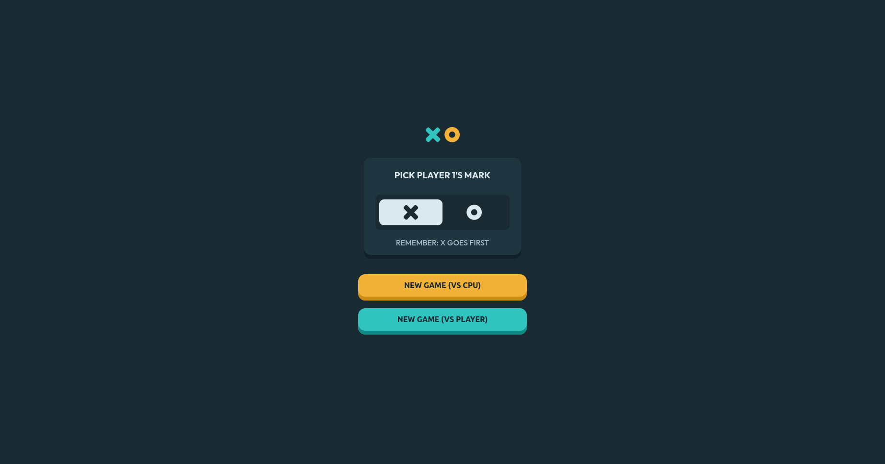

# Tic-Tac-Toe

# Odin Project - tic-tac-toe Challange

This is a solution to Odin Projects tic-tac-toe challange.

## Table of contents

- [Overview](#overview)
  - [Screenshot](#screenshot)
  - [Links](#links)
- [What I've learned](#Learned)
- [Author](#author)

## Overview

This is a simple tic-tac-toe game. Design is from frontendmentor.

### Screenshot

### Links

[Click to view live site](https://gwynbleidd0014.github.io/tic-tac-toe/)

## Learned
In this project I really dived deep in to objects, discovered the beauty of closure and therefor used them in Modules. Used Factory function as well.
As for html and css nothing speacial here, but overall good practice.
## Author

Hello, I'm Ucha, you might know me as [gwynbleidd0014](https://github.com/gwynbleidd0014) on github
